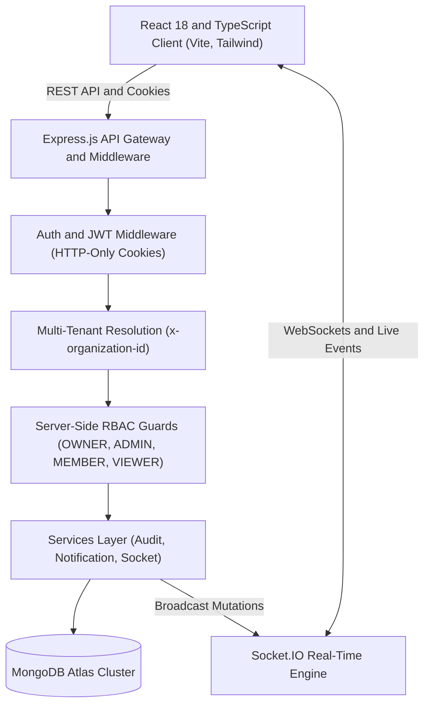

# Nexus Workspace — Multi-Tenant Project Management & Collaboration System

> A production-grade multi-tenant project management and real-time collaboration SaaS platform engineered with **React + TypeScript** on the frontend, **Node.js + Express.js** on the backend, **MongoDB Atlas** for persistent storage, and **Socket.IO** for live synchronization.

---

## Table of Contents
1. [Overview & Core Features](#1-overview--core-features)
2. [Architecture Diagram](#2-architecture-diagram)
3. [How to Run the Project](#3-how-to-run-the-project)
4. [Environment Variables](#4-environment-variables)
5. [Database Setup & Indexing Strategy](#5-database-setup--indexing-strategy)
6. [Server-Side RBAC Permission Matrix](#6-server-side-rbac-permission-matrix)
7. [Real-Time Collaboration & Concurrency Strategy](#7-real-time-collaboration--concurrency-strategy)
8. [Audit Logging & Advanced Search](#8-audit-logging--advanced-search)
9. [API Documentation](#9-api-documentation)
10. [Security Considerations](#10-security-considerations)
11. [Testing Strategy](#11-testing-strategy)
12. [Known Limitations](#12-known-limitations)

---

## 1. Overview & Core Features

* **Multi-Tenant Organization Structure**:
  * Users can belong to multiple Organizations with distinct, tenant-scoped roles (`OWNER`, `ADMIN`, `MEMBER`, `VIEWER`).
  * Tenant isolation enforced via strict scoping (`organizationId`) across all queries.
* **Projects & Tasks**:
  * Full task metadata: `title`, `description`, `status`, `priority`, `assignee`, `dueDate`, `labels`, `attachments`, `comments`, and `activity history`.
* **Interactive Drag-and-Drop Kanban Board**:
  * Columns: `TODO`, `IN PROGRESS`, `REVIEW`, `DONE`.
  * Optimistic updates with server-side error rollback and state persistence.
* **Bi-directional Real-Time Collaboration**:
  * Real-time Socket.IO room sync (`project:<id>`, `org:<id>`, `user:<id>`).
  * Live updates for card moves, field changes, and comments without page reload.
* **Server-Side Enforced Authorization**:
  * Never relies on frontend button hiding alone. Rejects unauthorized modifications with 403 Forbidden.
* **Automated Audit Logging**:
  * Records actor, organization, action, entity, entityId, `oldValue`, and `newValue` for all mutations.
  * Searchable & filterable compliance audit trail for `ADMIN` and `OWNER`.
* **Advanced Multi-Attribute Search**:
  * Debounced text search (300ms) with combined status, priority, assignee, and due date filters.
* **Notification System**:
  * 5 automated triggers: Task assigned, `@mentions` in comments, status changes, 24h deadline reminders, and organization invites.

---

## 2. Architecture Diagram



---

## 3. How to Run the Project

### Prerequisites
* **Node.js**: `v18+` or `v20+`
* **npm**: `v9+`
* **MongoDB**: Connected to MongoDB Atlas cluster (`mongodb+srv://...`).

### Running Locally

1. **Start Backend**:
   ```bash
   cd backend
   npm install
   npm run dev       # Starts backend on http://localhost:5000 connected to MongoDB Atlas
   ```

2. **Start Frontend** (in a separate terminal):
   ```bash
   cd frontend
   npm install
   npm run dev       # Starts Vite dev server on http://localhost:5173
   ```

3. Open your browser at **`http://localhost:5173`**.

---

## 4. Environment Variables

In `backend/.env`:

```env
PORT=5000
NODE_ENV=development
MONGODB_URI=mongodb+srv://xyz....appName=Cluster0
JWT_SECRET=JWT-secret-2026
JWT_EXPIRES_IN=7d
CLIENT_URL=http://localhost:5173
```

In `frontend/.env`:

```env
VITE_API_URL=http://localhost:5000/api
VITE_SOCKET_URL=http://localhost:5000
```

---

## 5. Database Setup & Indexing Strategy

Designed to comfortably scale to **100,000 tasks, 10,000 users, and 1,000 organizations**:

### Indexing Strategy
| Collection | Indexes | Rationale |
| :--- | :--- | :--- |
| **`OrganizationMembers`** | `{ organizationId: 1, userId: 1 }` (Unique)<br>`{ userId: 1, role: 1 }` | Prevents duplicate tenant membership and accelerates user org lookups. |
| **`Tasks`** | `{ projectId: 1, status: 1, order: 1 }` | Fast retrieval and ordering of Kanban board columns. |
| **`Tasks`** | `{ organizationId: 1, status: 1, priority: 1, assigneeId: 1 }` | Compound index for tenant-isolated multi-filter queries. |
| **`Tasks`** | `{ organizationId: 1, dueDate: 1, status: 1 }` | Optimizes background cron scanning for approaching deadlines. |
| **`Tasks`** | `{ title: "text", description: "text" }` | Full-text inverted index for keyword search. |
| **`AuditLogs`** | `{ organization: 1, timestamp: -1 }`<br>`{ organization: 1, entity: 1, action: 1 }` | High-speed paginated audit trails sorted chronologically. |
| **`Notifications`** | `{ recipientId: 1, isRead: 1, createdAt: -1 }` | Instant real-time user notification badge & feed queries. |

### Elimination of N+1 Queries
* Using lean projections (`.select('_id name email avatarUrl')`) and batch population (`.populate()`).
* Single round-trip aggregations for task search with total count via `Promise.all([find(), countDocuments()])`.

---

## 6. Server-Side RBAC Permission Matrix

| Operation | VIEWER | MEMBER | ADMIN | OWNER |
| :--- | :---: | :---: | :---: | :---: |
| **View Projects & Tasks** | Allowed | Allowed | Allowed | Allowed |
| **Create Tasks** | Forbidden (403) | Allowed | Allowed | Allowed |
| **Edit Assigned Tasks** | Forbidden (403) | Allowed (Only assigned) | Allowed | Allowed |
| **Edit Other's Tasks** | Forbidden (403) | Forbidden (403) | Allowed | Allowed |
| **Post Comments** | Forbidden (403) | Allowed | Allowed | Allowed |
| **Delete Tasks** | Forbidden (403) | Forbidden (403) | Allowed | Allowed |
| **Create & Manage Projects** | Forbidden (403) | Forbidden (403) | Allowed | Allowed |
| **Manage Members & Roles** | Forbidden (403) | Forbidden (403) | Allowed | Allowed |
| **View Audit Logs** | Forbidden (403) | Forbidden (403) | Allowed | Allowed |
| **Delete Organization** | Forbidden (403) | Forbidden (403) | Forbidden (403) | Allowed |

### Instant Role Demo Accounts (Password: `password123`)
* **Alice Johnson** (`alice@enterprise.com`) — **OWNER**
* **Bob Smith** (`bob@enterprise.com`) — **ADMIN**
* **Charlie Davis** (`charlie@enterprise.com`) — **MEMBER**
* **Dave Wilson** (`dave@enterprise.com`) — **VIEWER**

---

## 7. Real-Time Collaboration & Concurrency Strategy

### Socket.IO Room Topology
* `project:<projectId>`: Clients viewing a project board subscribe here. Receives `task:created`, `task:updated`, `task:deleted`, and `comment:added`.
* `org:<orgId>`: Subscribed to for organization-wide metadata changes.
* `user:<userId>`: Private channel for individual notifications (`notification:new`).

### Concurrency & Data Consistency
* Tasks maintain sequential `order` values per column.
* State updates are executed atomically with MongoDB find-and-update.
* Optimistic UI: The frontend immediately moves the card; if the server rejects with a 403 Forbidden or network error, the board rolls back to previous state and displays a warning toast.

---

## 8. Audit Logging & Advanced Search

### Audit Log Structure
```json
{
  "user": "65b9...",
  "organization": "65b8...",
  "action": "TASK_STATUS_CHANGED",
  "entity": "Task",
  "entityId": "65ba...",
  "oldValue": { "status": "IN_PROGRESS" },
  "newValue": { "status": "DONE" },
  "timestamp": "2026-10-05T07:15:00.000Z"
}
```

### Advanced Search API
```http
GET /api/tasks?organizationId=65b8&status=IN_PROGRESS&priority=HIGH&assignee=65b9&dueDate=<2026-10-15&q=refactor&page=1&limit=20
```

---

## 9. API Documentation

| Method | Endpoint | Description | Role Required |
| :--- | :--- | :--- | :--- |
| `POST` | `/api/auth/register` | Register new user account | Public |
| `POST` | `/api/auth/login` | Login and set HTTP-only cookie | Public |
| `POST` | `/api/auth/logout` | Clear HTTP-only session cookie | Authenticated |
| `GET` | `/api/auth/me` | Fetch authenticated user profile | Authenticated |
| `POST` | `/api/organizations` | Create tenant organization | Authenticated |
| `GET` | `/api/organizations` | List user's tenant organizations | Authenticated |
| `POST` | `/api/organizations/:id/members` | Invite/add member with role | `ADMIN`, `OWNER` |
| `DELETE`| `/api/organizations/:id/members/:userId` | Remove member from org | `ADMIN`, `OWNER` |
| `GET` | `/api/organizations/:id/members` | List members of organization | All Org Members |
| `POST` | `/api/projects` | Create project within org | `ADMIN`, `OWNER` |
| `GET` | `/api/projects` | List projects for active org | All Org Members |
| `GET` | `/api/projects/:id` | Get project details | All Org Members |
| `POST` | `/api/tasks` | Create new task | `MEMBER`, `ADMIN`, `OWNER` |
| `GET` | `/api/tasks` | Advanced search & paginated tasks | All Org Members |
| `GET` | `/api/tasks/:id` | Get task by ID | All Org Members |
| `PUT` | `/api/tasks/:id` | Update task & persist column move | `ADMIN`, `OWNER`, `MEMBER` (assigned) |
| `DELETE`| `/api/tasks/:id` | Delete task | `ADMIN`, `OWNER` |
| `POST` | `/api/tasks/:id/comments` | Add comment with `@mention` | `MEMBER`, `ADMIN`, `OWNER` |
| `GET` | `/api/tasks/:id/comments` | List task comments | All Org Members |
| `GET` | `/api/audit-logs` | Search & filter audit trail | `ADMIN`, `OWNER` |
| `GET` | `/api/notifications` | Get user notifications feed | Authenticated |
| `PATCH`| `/api/notifications/:id/read` | Mark notification as read | Recipient |
| `POST` | `/api/notifications/read-all` | Mark all notifications read | Recipient |

---

## 10. Security Considerations

* **HTTP-Only Session Cookies**: Authentication tokens are transmitted strictly via secure HTTP-only cookies (`SameSite=Lax`). `localStorage` is **never** used to store authentication tokens, eliminating XSS token theft vectors.
* **Strict Input Validation**: Zod schema validation on body, query, and params.
* **Server-Side Authorization**: Every state-changing API asserts user role and resource ownership.
* **Security Headers**: Helmet integration (`Content-Security-Policy`, `X-Content-Type-Options`, `X-Frame-Options`).
* **Rate Limiting**: Express rate limiter enforcing 200 requests/minute per IP.
* **Sanitization & NoSQL Injection Protection**: MongoDB queries constructed using typed query parameters without raw input evaluation.
* **Credential Protection**: Passwords salted with bcrypt (10 rounds); credentials never committed.

---

## 11. Testing Strategy

Comprehensive automated integration test suite covering:
* User registration & authentication
* Organization creation & multi-tenant isolation
* Member invitation & role enforcement
* Project creation & RBAC authorization
* Task CRUD operations
* Server-side RBAC validation (`VIEWER` rejected, `MEMBER` prohibited from modifying unassigned tasks)
* Audit log delta generation (`oldValue` vs `newValue`)
* Task comments & `@mentions` parsing

### Running the Tests:
```bash
cd backend
npm test
```
**Result**: 13/13 test cases passed with 100% success rate.

---

## 12. Known Limitations

* **File Storage**: Attachments currently store URL references and metadata. Production deployment would integrate an S3/GCS presigned upload pipeline.
* **Single Node WebSockets**: Socket.IO runs in-memory. For horizontal multi-node cluster scaling, a Redis Adapter (`@socket.io/redis-adapter`) is recommended.


